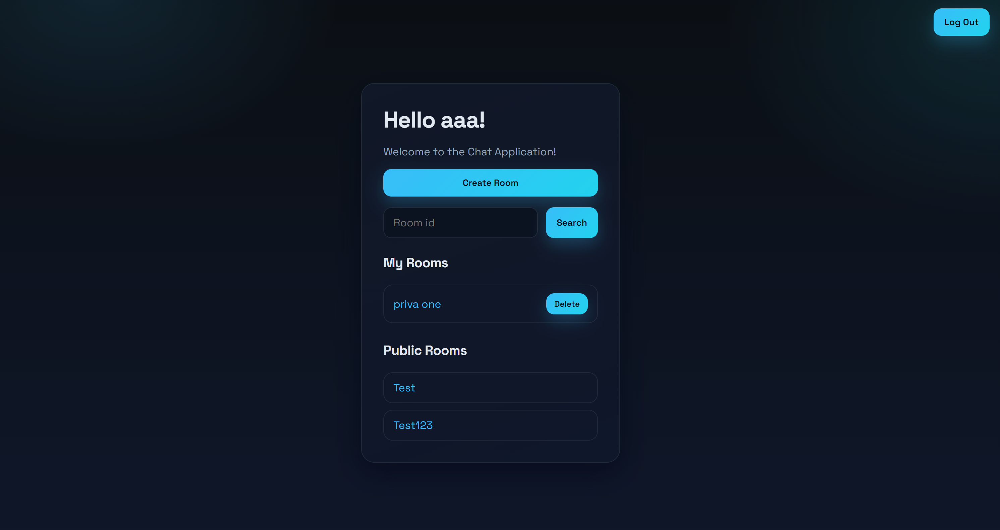
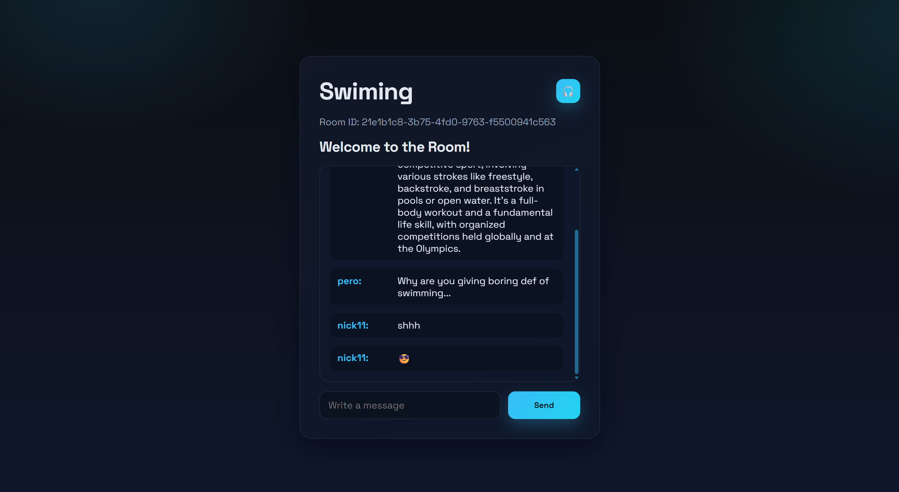

# Anonymous Chat

Real-time anonymous chat rooms with Socket.IO, Express, and simple session-based login. Create public or private rooms, chat live, and start voice calls with WebRTC signaling.

## Features
- Session-based login with a username
- Create public or private rooms
- Join rooms and chat in real time
- Message history per room (in-memory)
- WebRTC signaling events for voice calls

## Tech Stack
- Node.js
- Express
- Socket.IO
- Express Session
- UUID

## Getting Started
1) Install dependencies:
```bash
npm install
```

2) Start the server:
```bash
npm start
```

3) Open the app:
```
http://localhost:3000
```

## Usage
- Enter a username to sign in
- Create a room (public or private)
- Share room links to invite others

## Screenshots







## Routes and APIs (Server)
- `GET /` login page
- `POST /login` sign in with username
- `GET /home` home page after login
- `GET /create_room` create room page
- `POST /create_room` create a new room
- `GET /rooms/public` list public rooms
- `GET /rooms/user` list rooms created by the current user
- `DELETE /rooms/delete/:roomId` delete a room created by the current user
- `GET /room/:roomId` room page
- `GET /room/details/:roomId` room details
- `GET /get_username` return the logged-in username
- `POST /logout` logout

## Notes
- Room data and message history are stored in memory and reset when the server restarts.
- The session secret is hardcoded in `server.js` and should be moved to an environment variable for production.

## License
ISC